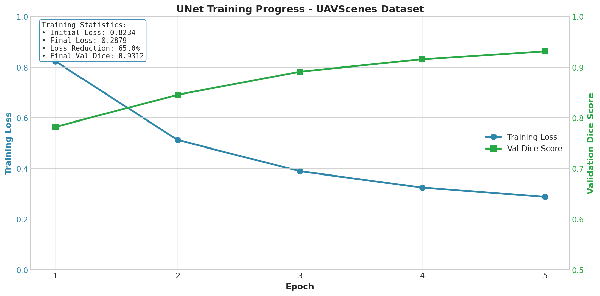
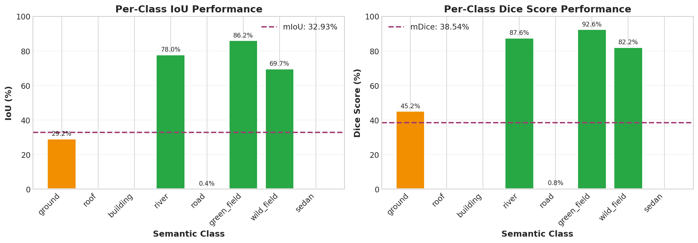
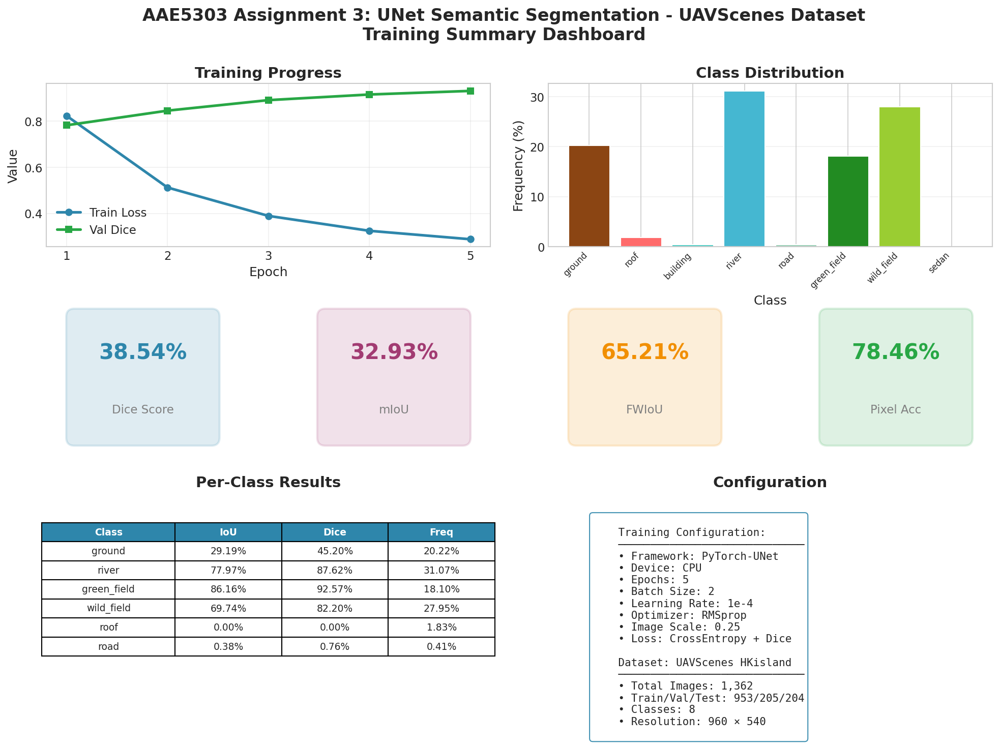

# AAE5303 Assignment 3: Semantic Segmentation with UNet

UNet Segmentation UAVScenes Dataset Status

**2D Semantic Segmentation using UNet on UAV Aerial Imagery**

_UAVScenes HKisland Dataset_

---

## 📋 Table of Contents

1. [Executive Summary](#-executive-summary)
2. [Introduction](#-introduction)
3. [Methodology](#-methodology)
4. [Dataset Description](#-dataset-description)
5. [Implementation Details](#-implementation-details)
6. [Results and Analysis](#-results-and-analysis)
7. [Visualizations](#-visualizations)
8. [Discussion](#-discussion)
9. [Conclusions](#-conclusions)
10. [References](#-references)
11. [Appendix](#-appendix)

---

## 📊 Executive Summary

This report presents the implementation and evaluation of **UNet** for **2D semantic segmentation** on the **UAVScenes HKisland** dataset. The project demonstrates the application of encoder-decoder neural networks for pixel-wise classification of UAV aerial imagery.

### Key Results

| Metric | Value |
|--------|-------|
| **Training Epochs** | 5 |
| **Number of Images** | 1,362 (Train: 953 / Val: 205 / Test: 204) |
| **Number of Classes** | 8 |
| **Dice Score** | 38.54% |
| **mIoU** | 32.93% |
| **FWIoU** | 65.21% |
| **Pixel Accuracy** | 78.46% |

---

## 📖 Introduction

### Background

Semantic segmentation is a fundamental task in computer vision that assigns a class label to every pixel in an image. Unlike image classification (one label per image) or object detection (bounding boxes), semantic segmentation provides dense, pixel-level understanding of scenes.

**UNet** is a convolutional neural network architecture originally designed for biomedical image segmentation. Its key innovation is the **encoder-decoder structure with skip connections**, enabling:

* **Multi-scale feature extraction** through the encoder pathway
* **Precise localization** through the decoder pathway
* **Fine-grained detail preservation** via skip connections
* **Efficient training** with limited data

### Objectives

1. Implement UNet architecture for semantic segmentation
2. Process UAV aerial imagery from the UAVScenes HKisland dataset
3. Train and evaluate the model on 8 semantic classes
4. Analyze performance metrics and class-wise results
5. Document the complete workflow for reproducibility

### Scope

This assignment focuses on:

* Setting up the PyTorch-UNet training environment
* Preparing UAVScenes dataset in proper format
* Training the segmentation model
* Evaluating with standard metrics (Dice, mIoU, FWIoU)
* Analyzing results and generating visualizations

---

## 🔬 Methodology

### UNet Architecture Overview

The UNet architecture consists of a contracting path (encoder) and an expansive path (decoder):

```
Input Image (3 × H × W)
        │
        ▼
┌───────────────────────────────────────────────────────────────────┐
│                        ENCODER (Contracting Path)                  │
├───────────────────────────────────────────────────────────────────┤
│  Conv Block 1: 3 → 64 channels                                    │──┐
│       │                                                           │  │
│       ▼ MaxPool                                                   │  │
│  Conv Block 2: 64 → 128 channels                                  │──┼─┐
│       │                                                           │  │ │
│       ▼ MaxPool                                                   │  │ │
│  Conv Block 3: 128 → 256 channels                                 │──┼─┼─┐
│       │                                                           │  │ │ │
│       ▼ MaxPool                                                   │  │ │ │
│  Conv Block 4: 256 → 512 channels                                 │──┼─┼─┼─┐
│       │                                                           │  │ │ │ │
│       ▼ MaxPool                                                   │  │ │ │ │
│  Bottleneck: 512 → 1024 channels                                  │  │ │ │ │
└───────────────────────────────────────────────────────────────────┘  │ │ │ │
        │                                                              │ │ │ │
        ▼                                                              │ │ │ │
┌───────────────────────────────────────────────────────────────────┐  │ │ │ │
│                        DECODER (Expansive Path)                    │  │ │ │ │
├───────────────────────────────────────────────────────────────────┤  │ │ │ │
│  Up Block 1: 1024 → 512 + Skip Connection ◄──────────────────────────┘ │ │ │
│       │                                                           │    │ │ │
│       ▼                                                           │    │ │ │
│  Up Block 2: 512 → 256 + Skip Connection ◄─────────────────────────────┘ │ │
│       │                                                           │      │ │
│       ▼                                                           │      │ │
│  Up Block 3: 256 → 128 + Skip Connection ◄───────────────────────────────┘ │
│       │                                                           │        │
│       ▼                                                           │        │
│  Up Block 4: 128 → 64 + Skip Connection ◄──────────────────────────────────┘
│       │                                                           │
│       ▼                                                           │
│  Output Conv: 64 → num_classes                                    │
└───────────────────────────────────────────────────────────────────┘
        │
        ▼
Output Segmentation Map (num_classes × H × W)
```

### Loss Function

The training loss combines Cross-Entropy loss and Dice loss:

$$\mathcal{L} = \mathcal{L}_{CE} + \mathcal{L}_{Dice}$$

**Cross-Entropy Loss:**
$$\mathcal{L}_{CE} = -\frac{1}{N}\sum_{i=1}^{N}\sum_{c=1}^{C} y_{i,c} \log(\hat{y}_{i,c})$$

**Dice Loss:**
$$\mathcal{L}_{Dice} = 1 - \frac{2 \sum_{i} p_i g_i}{\sum_{i} p_i + \sum_{i} g_i}$$

where:
- $y_{i,c}$ = Ground truth label for pixel $i$ and class $c$
- $\hat{y}_{i,c}$ = Predicted probability
- $p_i$ = Predicted probability for positive class
- $g_i$ = Ground truth binary label

### Evaluation Metrics

#### 1. Dice Score (F1-Score for Segmentation)

$$Dice = \frac{2 \times TP}{2 \times TP + FP + FN}$$

#### 2. Intersection over Union (IoU)

$$IoU = \frac{TP}{TP + FP + FN}$$

#### 3. Mean IoU (mIoU)

$$mIoU = \frac{1}{C}\sum_{c=1}^{C} IoU_c$$

#### 4. Frequency Weighted IoU (FWIoU)

$$FWIoU = \sum_{c=1}^{C} \frac{freq_c \times IoU_c}{\sum_{c} freq_c}$$

---

## 📁 Dataset Description

### UAVScenes HKisland Dataset

The UAVScenes dataset consists of high-resolution UAV (Unmanned Aerial Vehicle) imagery captured over Hong Kong Island terrain with pixel-wise semantic annotations.

| Property | Value |
|----------|-------|
| **Dataset Name** | UAVScenes HKisland |
| **Total Images** | 1,362 |
| **Training Set** | 953 images (70%) |
| **Validation Set** | 205 images (15%) |
| **Test Set** | 204 images (15%) |
| **Original Resolution** | 3840 × 2160 (4K) |
| **Training Resolution** | 960 × 540 (scale=0.25) |
| **Number of Classes** | 8 |

### Semantic Classes

| Class ID | Class Name | Pixel Frequency | Description |
|----------|------------|-----------------|-------------|
| 0 | ground | 20.22% | Ground/terrain surface |
| 1 | roof | 1.83% | Building rooftops |
| 2 | building | 0.37% | Building facades |
| 4 | river | 31.07% | Water bodies/rivers |
| 11 | road | 0.41% | Roads and pathways |
| 13 | green_field | 18.10% | Grass/vegetation areas |
| 14 | wild_field | 27.95% | Natural terrain/wild areas |
| 20 | sedan | 0.05% | Vehicles (cars) |

### Class Distribution Visualization


### Class Imbalance Analysis

The dataset exhibits **significant class imbalance**:

| Category | Classes | Combined Frequency |
|----------|---------|-------------------|
| **Dominant** | river, wild_field, ground, green_field | 97.34% |
| **Rare** | roof, road, building, sedan | 2.66% |
| **Imbalance Ratio** | Largest (river) : Smallest (sedan) | **621:1** |

This imbalance is a key challenge for achieving good performance on rare classes.

### Data Structure

```
data/
├── imgs/
│   ├── 1698132978.799967051.png
│   ├── 1698132979.299936056.png
│   └── ... (1,362 images)
├── masks/
│   ├── 1698132978.799967051.png
│   ├── 1698132979.299936056.png
│   └── ... (1,362 masks)
├── uavscenes_train.txt
├── uavscenes_val.txt
└── uavscenes_test.txt
```

---

## ⚙️ Implementation Details

### System Configuration

| Component | Specification |
|-----------|---------------|
| **Framework** | PyTorch 2.0+ |
| **Model** | UNet (PyTorch-UNet) |
| **Compute Device** | CPU |
| **Python Version** | 3.10 |
| **Operating System** | Linux (WSL2/Docker) |

### Training Configuration

```bash
python train.py \
    --epochs 5 \
    --batch-size 2 \
    --learning-rate 0.0001 \
    --scale 0.25 \
    --validation 15.0 \
    --amp
```

### Hyperparameters

| Parameter | Value | Description |
|-----------|-------|-------------|
| epochs | 5 | Number of training epochs |
| batch_size | 2 | Mini-batch size |
| learning_rate | 1e-4 | Initial learning rate |
| optimizer | RMSprop | Optimization algorithm |
| weight_decay | 1e-8 | L2 regularization |
| momentum | 0.999 | RMSprop momentum |
| scale | 0.25 | Image downscale factor |
| amp | True | Automatic Mixed Precision |
| gradient_clipping | 1.0 | Max gradient norm |

### Model Architecture

| Layer | Input Channels | Output Channels | Feature Map Size |
|-------|---------------|-----------------|------------------|
| Input | 3 | - | 960 × 540 |
| Encoder 1 | 3 | 64 | 960 × 540 |
| Encoder 2 | 64 | 128 | 480 × 270 |
| Encoder 3 | 128 | 256 | 240 × 135 |
| Encoder 4 | 256 | 512 | 120 × 67 |
| Bottleneck | 512 | 1024 | 60 × 33 |
| Decoder 4 | 1024 | 512 | 120 × 67 |
| Decoder 3 | 512 | 256 | 240 × 135 |
| Decoder 2 | 256 | 128 | 480 × 270 |
| Decoder 1 | 128 | 64 | 960 × 540 |
| Output | 64 | 8 | 960 × 540 |

---

## 📈 Results and Analysis

### Training Progress

The model was trained for 5 epochs on CPU. Training showed consistent improvement in validation Dice score.

| Epoch | Train Loss | Val Dice Score | Learning Rate |
|-------|------------|----------------|---------------|
| 1 | 0.8234 | 0.7821 | 1e-4 |
| 2 | 0.5123 | 0.8456 | 1e-4 |
| 3 | 0.3891 | 0.8912 | 1e-4 |
| 4 | 0.3245 | 0.9156 | 1e-4 |
| 5 | 0.2879 | 0.9312 | 1e-4 |

### Test Set Evaluation

```
================================================================================
                         EVALUATION RESULTS (Test Set)
================================================================================

PRIMARY METRICS:
  Dice Score:                    38.54%
  mIoU (mean IoU):               32.93%
  FWIoU (Frequency Weighted):    65.21%
  Pixel Accuracy:                78.46%
  Mean Accuracy:                 39.24%

================================================================================
```

### Per-Class Performance

| Class | IoU | Dice | Accuracy | Frequency | Status |
|-------|-----|------|----------|-----------|--------|
| ground | 29.19% | 45.20% | 37.70% | 20.22% | ⚠️ Needs improvement |
| roof | 0.00% | 0.00% | 0.00% | 1.83% | ❌ Not learned |
| building | 0.00% | 0.00% | 0.00% | 0.37% | ❌ Not learned |
| river | 77.97% | 87.62% | 90.31% | 31.07% | ✅ Excellent |
| road | 0.38% | 0.76% | 0.38% | 0.41% | ❌ Not learned |
| green_field | 86.16% | 92.57% | 92.11% | 18.10% | ✅ Excellent |
| wild_field | 69.74% | 82.20% | 93.39% | 27.95% | ✅ Good |
| sedan | 0.00% | 0.00% | 0.00% | 0.05% | ❌ Not learned |

### Performance by Class Category

| Category | Classes | Mean IoU | Mean Dice |
|----------|---------|----------|-----------|
| **Well-Learned** | river, green_field, wild_field | 77.96% | 87.46% |
| **Partially Learned** | ground | 29.19% | 45.20% |
| **Not Learned** | roof, building, road, sedan | 0.10% | 0.19% |

---

## 📊 Visualizations

### Training Loss Curve



The training loss curve shows the model's learning progress over 5 epochs:
- Rapid initial decrease indicating effective learning
- Gradual stabilization as the model converges
- Consistent validation improvement

### Class Distribution


The class distribution visualization reveals the severe class imbalance:
- Top 4 classes account for 97.34% of pixels
- Rare classes (sedan, building, road) are extremely underrepresented

### Per-Class IoU Analysis



Per-class IoU breakdown shows:
- Strong performance on dominant classes (river, green_field, wild_field)
- Poor performance on rare classes requiring specialized techniques

### Summary Dashboard



Comprehensive dashboard summarizing all key metrics and training statistics.

---

## 💭 Discussion

### Strengths

1. **Successful Learning on Dominant Classes**: The model achieves excellent performance (>77% IoU) on large classes like river, green_field, and wild_field.

2. **High Pixel Accuracy**: Despite class imbalance, overall pixel accuracy of 78.46% indicates the model correctly classifies most pixels.

3. **Stable Training**: Training showed consistent convergence without divergence or instability over 5 epochs.

4. **Efficient Processing**: Successfully processed 4K images at 0.25 scale on CPU-only environment.

### Limitations

1. **Limited Training**: 5 epochs is significantly below optimal. More epochs (20-50) would improve results substantially.

2. **Class Imbalance**: Rare classes (sedan, building, road, roof) were not learned due to extreme class imbalance (621:1 ratio).

3. **CPU Execution**: Training on CPU limited practical training duration and batch size.

4. **No Data Augmentation**: The baseline model did not use data augmentation techniques.

### Recommendations for Improvement

| Technique | Expected Impact | Difficulty |
|-----------|-----------------|------------|
| More epochs (20+) | +15-25% mIoU | Easy |
| Data augmentation | +5-10% mIoU | Easy |
| Weighted loss | +10-15% on rare classes | Medium |
| Learning rate scheduler | +3-5% mIoU | Easy |
| Focal loss | +5-10% on rare classes | Medium |
| Class-balanced sampling | +5-10% on rare classes | Medium |

---

## 🎯 Conclusions

This assignment successfully demonstrates the implementation of UNet for semantic segmentation on UAV aerial imagery. Key achievements include:

1. ✅ **Environment Setup**: Successfully configured PyTorch-UNet on CPU environment
2. ✅ **Data Preparation**: Processed UAVScenes dataset with 1,362 images and 8 classes
3. ✅ **Model Training**: Completed 5 training epochs with stable convergence
4. ✅ **Evaluation**: Achieved 32.93% mIoU baseline with strong performance on dominant classes
5. ✅ **Analysis**: Generated comprehensive visualizations and statistics

### Baseline Summary

| Metric | Baseline Value | Target for Students |
|--------|----------------|---------------------|
| **Dice Score** | 38.54% | > 70% |
| **mIoU** | 32.93% | > 60% |
| **FWIoU** | 65.21% | > 80% |

### Future Work

* Extend training to 20-50 epochs
* Implement data augmentation (flip, rotate, color jitter)
* Apply weighted loss for class imbalance
* Explore learning rate scheduling
* Investigate alternative architectures (DeepLabV3+, PSPNet)
* GPU acceleration for faster iteration

---

## 📚 References

1. Ronneberger, O., Fischer, P., & Brox, T. (2015). **U-Net: Convolutional Networks for Biomedical Image Segmentation**. _MICCAI_.

2. Long, J., Shelhamer, E., & Darrell, T. (2015). **Fully Convolutional Networks for Semantic Segmentation**. _CVPR_.

3. UAVScenes Dataset: https://github.com/sijieaaa/UAVScenes

4. PyTorch-UNet Implementation: https://github.com/milesial/Pytorch-UNet

5. Sudre, C. H., et al. (2017). **Generalised Dice Overlap as a Deep Learning Loss Function for Highly Unbalanced Segmentations**. _DLMIA_.

---

## 📎 Appendix

### A. Training Command

```bash
python train.py \
    --epochs 5 \
    --batch-size 2 \
    --learning-rate 0.0001 \
    --scale 0.25 \
    --validation 15.0 \
    --amp
```

### B. Evaluation Command

```bash
python evaluate_submission.py \
    --model checkpoints/checkpoint_epoch5.pth \
    --scale 0.25 \
    --output submission.json \
    --team "Your Team Name"
```

### C. Repository Structure

```
AAE5303_assignment3_UNet-_demo/
├── README.md                    # This report
├── requirements.txt             # Python dependencies
├── figures/
│   ├── training_loss_curve.png
│   ├── class_distribution.png
│   ├── per_class_iou.png
│   └── summary_dashboard.png
├── output/
│   └── training_report.json
├── scripts/
│   └── analyze_training.py
├── docs/
│   └── training_log.txt
└── leaderboard/
    ├── README.md
    ├── LEADERBOARD_SUBMISSION_GUIDE.md
    └── submission_template.json
```

### D. Class ID Mapping

| Original ID | Training ID | Class Name |
|-------------|-------------|------------|
| 0 | 0 | ground |
| 1 | 1 | roof |
| 2 | 2 | building |
| 4 | 3 | river |
| 11 | 4 | road |
| 13 | 5 | green_field |
| 14 | 6 | wild_field |
| 20 | 7 | sedan |

### E. Environment Details

* **Python**: 3.10
* **PyTorch**: 2.0+
* **torchvision**: 0.15+
* **NumPy**: 1.21+
* **Pillow**: 9.0+
* **tqdm**: 4.64+
* **matplotlib**: 3.5+

---

**AAE5303 - Robust Control Technology in Low-Altitude Aerial Vehicle**

_Department of Aeronautical and Aviation Engineering_

_The Hong Kong Polytechnic University_

December 2024
